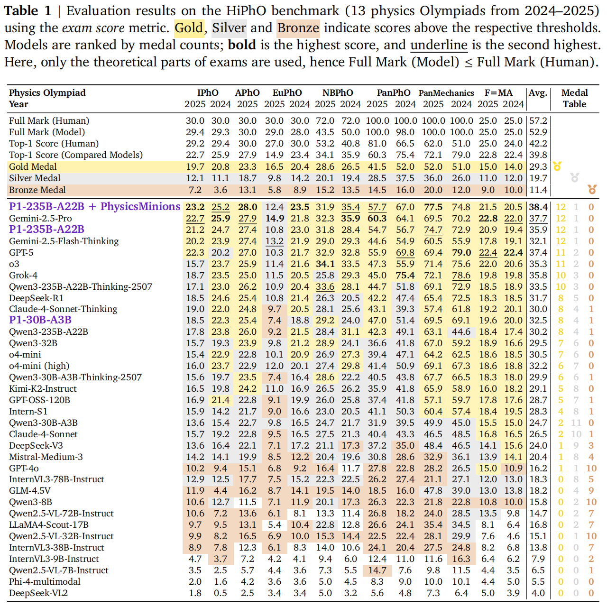

# P1: Mastering Physics Olympiads with Reinforcement Learning


[](https://prime-rl.github.io/P1/)
[](https://huggingface.co/PRIME-RL/P1-30B-A3B)
[](https://huggingface.co/PRIME-RL/P1-235B-A22B)
[](https://phyarena.github.io/)

<p align="center">
  
</p>


## 📘 Overview

Physics reasoning is central to understanding and shaping the real world. Top contests like the **International Physics Olympiad (IPhO)** set a high bar for complex reasoning and deep physical understanding — a benchmark for evaluating AI's grasp of reality.

**P1** is the first open-source model series designed to tackle Olympiad-level physics reasoning through **multi-stage reinforcement learning (RL)** and a **co-evolutionary multi-agent system (PhysicsMinions)**. We release two model versions:

- **[P1-30B-A3B](https://huggingface.co/PRIME-RL/P1-30B-A3B)**: A 30B parameter model that surpasses larger closed-source models, demonstrating exceptional efficiency
- **[P1-235B-A22B](https://huggingface.co/PRIME-RL/P1-235B-A22B)**: A 235B parameter model achieving gold medal performance on IPhO 2025, rivaling top closed-source models 

---

## 🧩 Table of Contents

1. [HiPhO Benchmark](#-hipho-benchmark)
2. [Reinforcement Learning Training](#-multi-stage-reinforcement-learning-training)
3. [Co-Evolution System](#-co-evolution-multi-agent-system-physicsminions)
4. [Results](#-results)
5. [Generalization Beyond Physics](#-generalized-specialists)
6. [Citation](#-citation)

---

## 🧮 HiPhO Benchmark

[**HiPhO (High School Physics Olympiad)**](https://arxiv.org/abs/2509.07894) is the first benchmark focused on recent Olympiad-level physics contests with **human-aligned evaluation**.

📚 It compiles 13 competitions (IPhO, APhO, EuPhO, etc.) from 2024–2025, using **official rubrics** and **fine-grained scoring** aligned with medal cutoffs.

---

## 🧠 Multi-Stage Reinforcement Learning Training

P1 is trained through **multi-stage reinforcement learning** on thousands of annotated Olympiad-level problems.  
Each stage expands the reasoning capacity and improves stability.

**Training Strategies:**
- 🪜 **Context window expansion** – gradually increases generation length, enabling longer reasoning chains.  
- 🧹 **Pass-rate filtering** – removes overly simple or impossible tasks to stabilize learning.

📈 This process yields **steady performance gains** and **longer coherent reasoning sequences**.

---

## 🧩 Co-Evolution Multi-Agent System: PhysicsMinions

To go beyond single-model limits, P1 introduces [**PhysicsMinions**](https://arxiv.org/abs/2509.24855) — a co-evolution multi-agent system that iteratively refines solutions through self-verification and reflection.

### 🧱 Three Modules:
| Module            | Function                                                     |
| ----------------- | ------------------------------------------------------------ |
| **Visual Studio** | Extracts structured visual information from diagrams (not used in current experiments). |
| **Logic Studio**  | Generates and refines initial reasoning chains.              |
| **Review Studio** | Performs two-stage validation: physical consistency and logical correctness. |

Failures trigger a **feedback loop** to improve the reasoning process — resulting in stronger robustness and reliability.


---

## 🏆 Results

P1 models demonstrate **top-tier physics reasoning** across all HiPhO contests.

<p align="center">
  
</p>

---

## 🌐 Generalized Specialists

P1’s physics reasoning transfers effectively across other STEM domains.

#### STEM Benchmarks

| Benchmark       | P1-235B-A22B | Qwen3-235B-A22B-Thinking-2507 | P1-30B-A3B | Qwen3-30B-A3B-Thinking-2507 |
| --------------- | ------------:| -----------------------------:| ----------:| ---------------------------:|
| AIME24          | 95.0         | 94.6                           | 91.0       | 90.4                        |
| AIME25          | 95.0         | 94.2                           | 91.0       | 85.0                        |
| HMMT            | 80.8         | 81.7                           | 76.9       | 71.3                        |
| GPQA            | 81.4         | 79.4                           | 74.4       | 73.0                        |
| HLE             | 19.1         | 17.5                           | 14.3       | 11.6                        |
| LiveCodeBench   | 75.8         | 76.2                           | 68.1       | 66.7                        |
| LiveBench       | 79.8         | 80.3                           | 77.0       | 76.6                        |


---


## 🙏 Acknowledgements

We are grateful to the open-source community for their invaluable contributions. Special thanks to:

- **[Qwen3](https://huggingface.co/collections/Qwen/qwen3)** - for providing the foundational base models that powered our research
- **[slime](https://github.com/THUDM/slime)** - for their innovative work on efficient reinforcement learning framework that powered our training pipeline
- **[verl](https://github.com/volcengine/verl)** - for the versatile reinforcement learning framework that enabled our training pipeline
- **[sglang](https://github.com/sgl-project/sglang)** - for the efficient LLM serving and inference infrastructure
- **[Megatron-LM](https://github.com/NVIDIA/Megatron-LM)** - for the large-scale model training framework

We also thank colleagues and collaborators who supported the development of P1 models, the accompanying datasets and visual assets.


## 🧾 Citation

If you find this work useful, please cite:

```bibtex
@misc{p12025,
  title={P1: Mastering Physics Olympiads with Reinforcement Learning},
  author={P1 Team},
  year={2025},
  url={https://prime-rl.github.io/P1/}
}