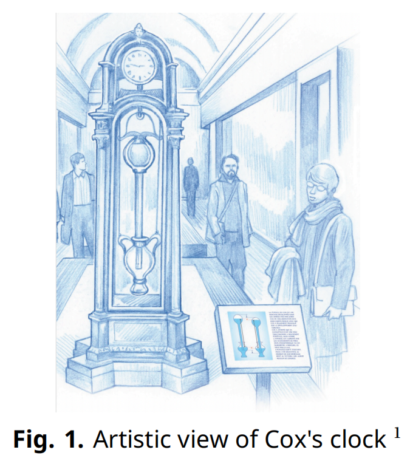
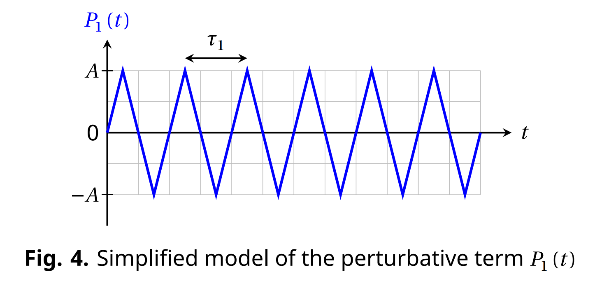
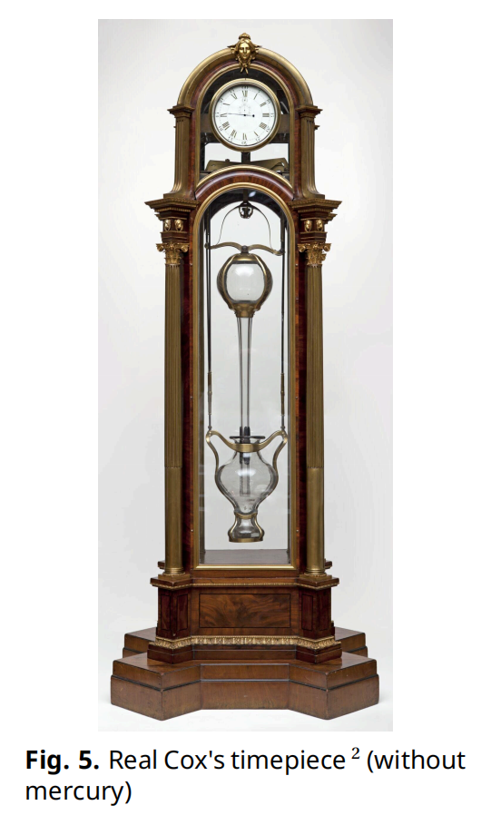
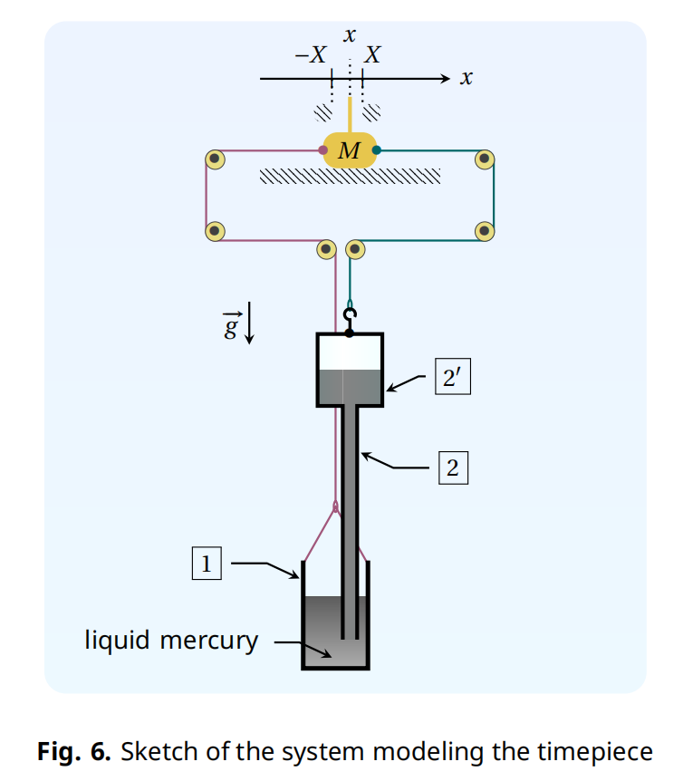

# Cox's Timepiece （大题背景）

In 1765, British clockmaker James Cox invented a clock whose only source of energy is the fluctuations in atmospheric pressure. Cox's clock used two vessels containing mercury. Changes in atmospheric pressure caused mercury to move between the vessels, and the two vessels to move relative to each other. This movement acted as an energy source for the actual clock. 

We propose an analysis of this device. Throughout, we assume that 
- the Earth's gravitational field $\vec{g} = -g\vec{u_{z}}$ is uniform with $g = 9.8 \mathrm{m} \cdot \mathrm{s}^{-2}$ and $\vec{u_{z}}$ a unit vector; 
- all liquids are incompressible and their density is denoted $\rho$; 
- no surface tension effects will be considered; 
- the variations of atmospheric pressure with altitude are neglected; 
- the surrounding temperature $T_{\mathrm{a}}$ is uniform and all transformations are isothermal. 

Fig. 1. Artistic view of Cox's clock 

## Part B - Two-part barometric tube （解part C需要用到part B的信息）

Fig. 4. Simplified model of the perturbative term $P_{1}(t)$ 

## Part C - Cox's timepiece （part C 的背景）

The real mechanism developed by Cox is complex (Fig. 5). We study a simplified version, depicted in Fig. 6, and described below: 
- a cylindrical bottom cistern containing a mercury bath; 
- a two-part barometric tube identical to that studied in part B, which is still completely emptied of any air, is dipped into the bath; 
- the cistern and the two-part tube are each suspended by a cable. Both cables (assumed to be inextensible and of negligible mass) pass through a system of ideal pullies and finish attached to either side of the same mass $M$, which can slide on a horizontal surface; 
- the total volume of liquid mercury contained in the system is $V_{\ell} = 5 \mathrm{L}$. 

The height, cross-section and masses of each part are given in Table 2. The position of mass $M$ is referenced by the coordinate $x$ of its center of mass. We consider solid friction between the horizontal support and the mass $M$, without distinction between static and dynamic coefficients; the magnitude of this force when sliding occurs is denoted $F_{\mathrm{s}}$. 

Two stops limit the displacement of the mass $M$ such that $-X \leq  x \leq X$ (with $X > 0$). Assume that the value of $X$ guarantees that the bottom of the two-part tube never touches the bottom of the cistern nor comes out of the liquid bath; and the altitude $z_{\ell}$ of the mercury column is always in the upper bulb. 

Fig. 5. Real Cox's timepiece (without mercury) 

Fig. 6. Sketch of the system modeling the timepiece 

|Reference|Name|Height|Cross section area|Empty mass|
|-|-|-|-|-|
|1|cistern|$H_{\mathrm{c}} = 30 \mathrm{cm}$|$S_{\mathrm{c}} = 210 \mathrm{cm}^{2}$|$m_{\mathrm{c}}$|
|2|tubular part of the barometric tube|$H_{\mathrm{t}} = 80 \mathrm{cm}$|$S_{\mathrm{t}} = 5 \mathrm{cm}^{2}$|rowspan=\"2\" total mass of the barometric tube : $m_{\mathrm{tb}}$|
|$2^{\prime}$|bulb of the barometric tube|$H_{\mathrm{b}} = 20 \mathrm{cm}$|$S_{\mathrm{b}} = 200 \mathrm{cm}^{2}$| | 
Table 2. Dimensions and notations for the model system 

The system evolves in contact with the atmosphere, whose pressure fluctuates as in Fig. 4 (still with amplitude $A = 5 \times 10^{2} \mathrm{Pa}$ and period $\tau_{1} = 1$ week). At the start $t = 0$, the mass $M$ is at rest at $x = 0$ and the tensions exerted by the two cables on either side of the mass $M$ are in balance while $P_{1}(0) = 0$. We define 

$$
\xi = \frac{S_{\mathrm{b}} + S_{\mathrm{c}} - S_{\mathrm{t}}}{S_{\mathrm{b}} S_{\mathrm{c}}} \frac{F_{\mathrm{s}}}{A} \simeq \frac{S_{\mathrm{b}} + S_{\mathrm{c}}}{S_{\mathrm{b}} S_{\mathrm{c}}} \frac{F_{\mathrm{s}}}{A}
\qquad (3)
$$ 
where the last expression uses that $S_{\mathrm{t}} \ll S_{\mathrm{b}}, S_{\mathrm{c}}$ (which we will assume is valid until the end of the problem). 

(C.1) Determine the threshold $\xi^{\star}$ such that $M$ remains indefinitely at rest when $\xi > \xi^{\star}$. 

For the question (C.2) only, suppose that the mass $M$ is temporarily blocked at $x = X$. 

(C.2) Give an expression for the total tension force $\vec{T} = T \vec{u_{x}}$ acting on the mass $M$ due to the tension in two cables at this position, when $P_{1} = 0$, in terms of $\rho, g, X$ and pertinent cross-sections. 

When $\xi < \xi^{\star}$, starting again from $x = 0$ and $P_{1} = 0$, two different behaviours can be observed for $t \geq  0$. To distinguish them, we need to introduce another parameter 
$$
\lambda = \frac{2 (S_{\mathrm{b}} - S_{\mathrm{t}}) }{S_{\mathrm{b}}} \frac{\rho g X}{A} \simeq \frac{2 \rho g X}{A}
\qquad (4)
$$ 

(C.3) Complete the table in the answer sheet to indicate the condition under which each regime is obtained. Conditions must be expressed as inequalities on $\xi$ and/or $\lambda$. In addition, sketch the variations of $x(t) / X$ for $t \in [0, 3 \tau_{1}]$ that are consistent with the variations of $P_{1}(t) / A$ already present. Specification of remarkable points coordinates is not required. 

In the real Cox's timepiece, energy provided by the mechanism is stored using a system of ratchets and used to raise a counterweight, like in a traditional clock. In the simplified model studied here, the energy recovered by the clock corresponds to the energy dissipated by the friction force exerted by the horizontal surface on the mass $M$. From now on, we assume that the system is dimensioned such that to work in the regime that allows the clock to recuperate energy. We also assume that the permanent regime is established. We denote $W$ the energy dissipated by the solid friction force during a period $\tau_{1}$, which can be expressed only in terms of $F_{\mathrm{s}}$ and $X$. 

All else equal, $F_{\mathrm{s}}$ and $X$ can be adjusted to maximize the energy $W$; we denote $F_{\mathrm{s}}^{\star}$ and $X^{\star}$ their respective values in the optimal situation.",
        

### (本题)
(C.4) Considering $S_{\mathrm{b}} \simeq S_{\mathrm{c}}$ and $S_{\mathrm{t}} \ll S_{\mathrm{b}}$, determine the expressions for (1) $F_{\mathrm{s}}^{\star}$ and (2) $X^{\star}$ as functions of $\rho, g, S_{\mathrm{c}}$ and $A$. (3) Express the corresponding maximum energy $W^{\star}$, (4) then calculate its numerical value in $\mathrm{mJ}$ with $A = 5 \times 10^{2} \mathrm{Pa}$.
